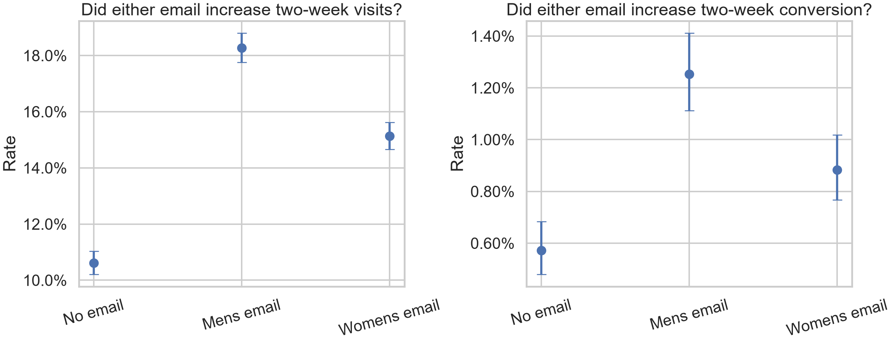
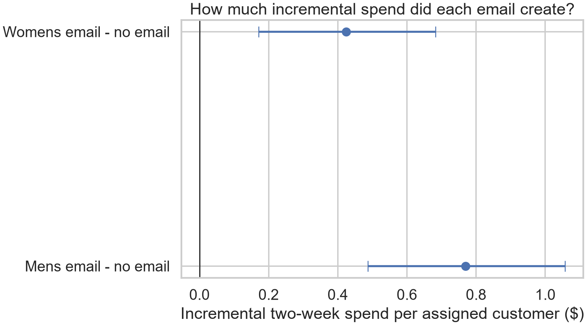
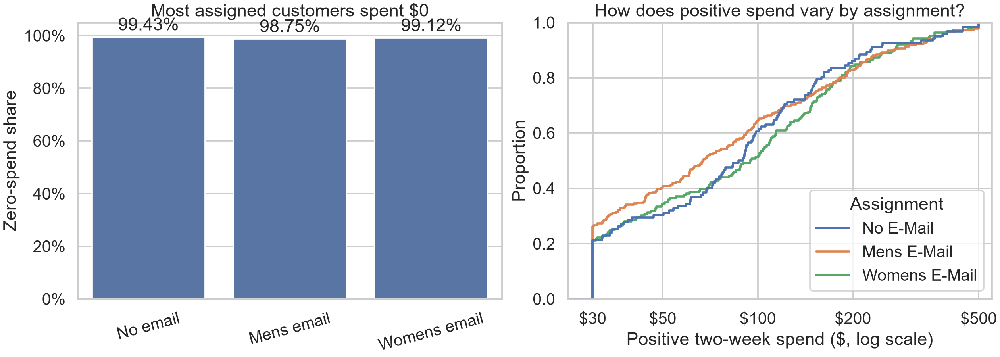

# Hillstrom 电商邮件营销增量实验

基于 64,000 名客户的三组公开历史随机邮件数据，评估 Mens/Womens 商品邮件相对不发邮件的两周增量收入，并检查实验完整性、统计精度、协变量稳健性和探索性客户分层。

> 诚信边界：这是公开历史实验的再分析，不是本人设计或上线的实验，也不声称真实预注册或盲态分析。Spend 是收入而非利润；没有成本与毛利数据时不报告 ROI。

## 项目状态

- B0–B5：完成
- B6 报告、测试与全量复现：完成
- Gate B-Stats / B-Repro：通过
- B7 简历与面试验收：待完成

B6 验收记录：16/16 项测试通过；删除 10 个生成 CSV 和 5 个 PNG 后，一键重建成功，CSV 哈希 0 项不一致。

完整报告见 `docs/final_report.md`，冻结方法见 `docs/analysis_plan.md`。

## 数据与冻结基线

- 原发布说明：<https://blog.minethatdata.com/2008/03/minethatdata-e-mail-analytics-and-data.html>
- 输入：`data/raw/hillstrom.csv`，64,000 行、12 列，Git忽略且Windows只读
- SHA-256：`0E5893329D8B93CEFECC571777672028290AB69865718020C78C7284F291AECE`
- 组别：No E-Mail 21,306；Mens E-Mail 21,307；Womens E-Mail 21,387
- 冻结协议 SHA-256：`43A7B844B3A0EC01DC0108D1B19ECC6A52FB9CA2992E9D9994C25474E82A90B8`

## 唯一推荐执行顺序

基准环境为 Python 3.12.7。直接依赖已固定：pandas 3.0.5、numpy 2.5.3、scipy 1.18.0、statsmodels 0.15.0、matplotlib 3.11.1、seaborn 0.13.2、pytest 9.1.1。

```powershell
python -m venv .venv
.\.venv\Scripts\python.exe -m pip install -r requirements.txt
.\.venv\Scripts\python.exe -m pytest -q -p no:cacheprovider
.\.venv\Scripts\python.exe -m src.run_all
```

主入口先校验输入 SHA-256、schema、逻辑规则、SRM 和实验前平衡，再生成全部分析结果。不要绕过 `src.run_all` 单独挑选脚本运行。

## 主要结果

| 对比 | Spend增量/客户 | Bootstrap 95% CI | Holm p | 调整后效应 |
|---|---:|---:|---:|---:|
| Mens - No E-Mail | +$0.770 | [$0.487, $1.057] | 2.33e-7 | +$0.769 |
| Womens - No E-Mail | +$0.424 | [$0.171, $0.682] | 0.00113 | +$0.428 |

- Mens 邮件：访问率 +7.66 pp，转化率 +0.681 pp。
- Womens 邮件：访问率 +4.52 pp，转化率 +0.311 pp。
- 转化率绝对 MDE 约 0.223 pp（双侧 alpha=0.05、power=0.80、控制基线0.5726%）。
- 8个客户分层交互检验均未通过Holm校正，当前没有已验证的定向规则。

业务结论：两种邮件在该历史实验中均提高两周客均收入；Mens 点估计更高，但次要直接比较不足以确认其为赢家。真实投放前需补充毛利、发送成本、退订/投诉、退货和长期价值。

## 三张核心图

### 漏斗辅助指标



### 主要Spend效应



### 零值和长尾分布



补充图：`04_adjusted_vs_unadjusted.png`、`05_subgroup_spend_effects.png`。

## 输出索引

| 内容 | 文件 |
|---|---|
| 数据QC、SRM、平衡 | `results/tables/data_qc.csv`、`srm_check.csv`、`balance_check.csv` |
| 描述统计与主要结果 | `group_summary.csv`、`experiment_effects.csv` |
| MDE、Spend精度、调整分析 | `conversion_mde.csv`、`spend_precision.csv`、`adjusted_effects.csv` |
| 探索性分层与交互 | `subgroup_spend_effects.csv`、`interaction_tests.csv` |
| 最终运行证据 | `results/b6_run_manifest.json` |
| 阶段/最终报告 | `docs/b2_data_quality_report.md` 至 `docs/b5_subgroup_report.md`、`docs/final_report.md` |

## 方法与限制

- ITT：所有随机分配客户进入分析，不按访问或购买筛选。
- Spend：10,000次客户级Bootstrap区间、双侧Welch检验、P1/P2 Holm校正。
- Visit/Conversion：百分点差、边际区间及两比例检验，属于辅助证据。
- 稳健性：实验前协变量 OLS/LPM + HC3；不把调整结果替换主结果。
- 分层：使用处理×实验前特征交互检验；同一数据发现的模式只作为新实验假设。
- 数据无客户ID，无法独立验证每行唯一客户；2008年的具体效果量不能直接外推到当前业务。

## 简历事实口径草案

以下内容仍需通过B7面试与简历门禁后再进入正式简历：

- 基于 Hillstrom 公开的6.4万名客户三组随机邮件历史数据，冻结再分析协议并完成数据逻辑、SRM、实验前平衡和MDE检查，构建可一键复现的实验评估流程。
- 以两周客均Spend为主要指标，采用10,000次客户级Bootstrap、Welch检验和Holm校正，估计Mens/Womens邮件相对空白组分别增加$0.770和$0.424/客户，并通过HC3调整与交互检验区分总体效果和待复验分层线索。
